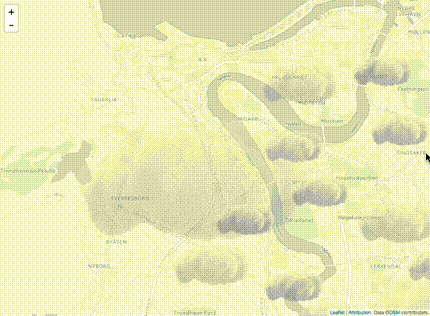
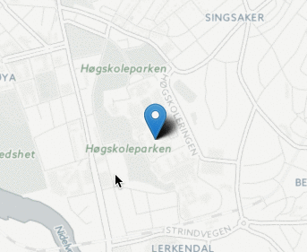

# Leaflet.ParallaxMarker

Markers that move with a parallax effect in relation to the base map.


## Demos / Examples
See demos/examples at [https://dagjomar.github.io/Leaflet.ParallaxMarker/](https://dagjomar.github.io/Leaflet.ParallaxMarker/).





## How to use

The option property `parallaxZoffset` determines **how much** of a parallax effect you want.
A higher number, means more effect.
0 means it will be stationary on the map, as in no effect at all

#### Example

The following example will stack a bunch of markers on top of each other in the z-axis
Notice that the offset doubles by a factor of 2 for a nice realistic effect




```
    var center = {lat: 63.417103647850126, lng: 10.403537750244142};

    L.Marker.parallax(center,{ parallaxZoffset: 0}).addTo(map);
    L.Marker.parallax(center,{ parallaxZoffset: 2}).addTo(map);
    L.Marker.parallax(center,{ parallaxZoffset: 4}).addTo(map);
    L.Marker.parallax(center,{ parallaxZoffset: 8}).addTo(map);
    L.Marker.parallax(center,{ parallaxZoffset: 16}).addTo(map);
    L.Marker.parallax(center,{ parallaxZoffset: 32}).addTo(map);
```

## TODO
- Make things work smoother on zoom animation